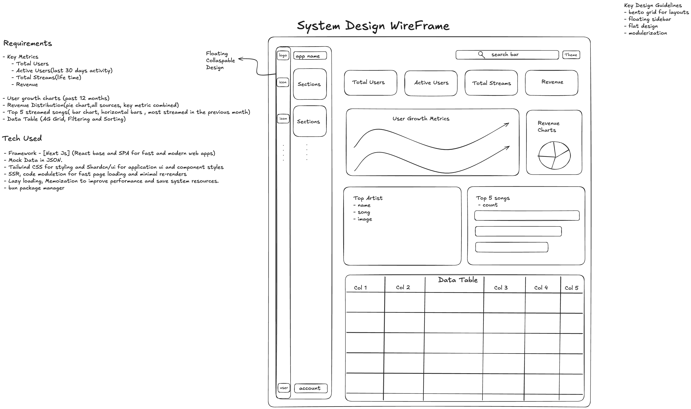
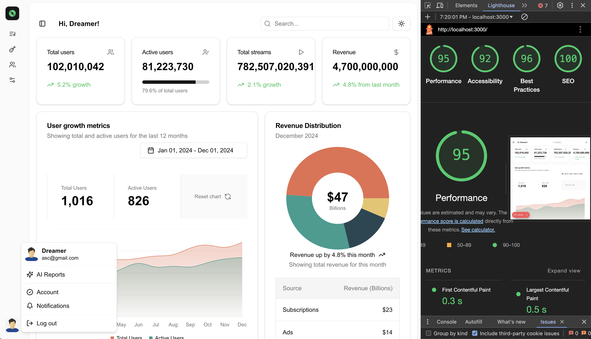

# Streamify - Music Analytics Dashboard

A modern analytics dashboard for the Streamify music streaming service, built with Next.js 15 and React 19.

## Key Features

- 📈 Comprehensive Analytics Dashboard
  - Key Metrics Display (Total Users, Active Users, Total Streams,Growth Rates)
  - Top Artist Information

- 📊 Data Visualization
  - User Growth Line Chart 
  - Revenue Distribution Pie Charts 
  - Top 5 Streamed Songs
  
- &#xf007; Interactive Data Tables with AG Grid
  - 📖 Sorting and Filtering functionalities for recent streams

- Bonus Features:
  - Implemented sorting and filtering for data tables.
  - Interactive charts, allowing hover and click actions for deeper insights.

  
- 🎨 Modern Design
  - Responsive Layout
  - Dark/Light Mode Support
  - Clean UI Components with shadcn/ui
  
- 🚀 Performance Optimized
  - Server-Side Rendering
  - Partial Pre-rendering
  - Interactive Charts and Tables

## Tech Stack

- Next.js 15
- React 19
- TypeScript
- Tailwind CSS
- shadcn/ui Components
- AG Grid for Tables
- Bun Package Manager

## Thought Process

1. Component Design:

   - The project was broken down into modular components for better maintainability.
   - Components were created for metrics, data visualizations, and the data table to separate concerns.

2. State Management:

   - Redux was used to manage the state of the sidebar and user information.
   - The dashboard pulls state information to determine layout adjustments and display personalized content.

3. Responsiveness:

   - Tailwind CSS was used to ensure that the dashboard is responsive across different devices.
   - Used ShadCN for better and responsive design.

4. Mock Data:

   - Mock data was used for charts and tables.

5. Performance Considerations:

   - Memoization and lazy loading were applied to improve performance where necessary.
   - State changes and layout adjustments are optimized to prevent unnecessary re-renders.

## Trade-offs
- **Mock Data:** Instead of connecting to a real backend, mock data was used. But a delay was added to mimic an API fetch.
- **Chart Interactivity:** The chart interactions are limited to hover and click events, but more advanced interactions like zoom or data export could be added in the future.
- **Testing:** Limited unit testing was performed due to time constraints.

## Getting Started

### Prerequisites

- Bun (Package Manager)
- Node.js

### Installation & Launch

```bash
brew install bun

bun i

bun dev       <==>    npm run dev

bun run build  <==>    npm run build
```

This will start the development server and the project will be accessible in your browser, typically at 
`http://localhost:3000`

### Project Structure

| _directory (/src) | Purpose        |
| ------------ | -------------- |
| app          | Next.js Routes    |
| components   | Reusable UI Components |
| lib          | Utilities & Helpers    |
| hooks        | Custom React Hooks |

### Core Features

## Navigation
 - Library management (Trending, Pending, Approved)
 - Artist tracking (Top Artists, Payments, Banned)
 - User analytics (Charts, Subscriptions, Quota, Streams)
 - Settings configuration

## Testing
- Framework: Vitest
- React Testing Library
- WIP in test branch

### Requiremnts docs and System WireFrame Design



### Performance Report


